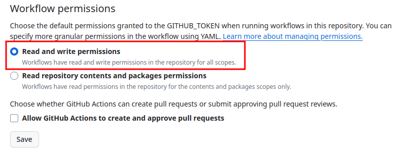
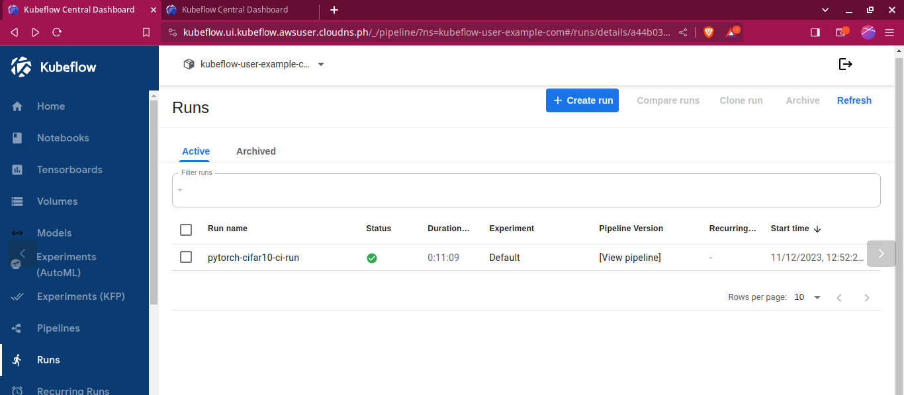
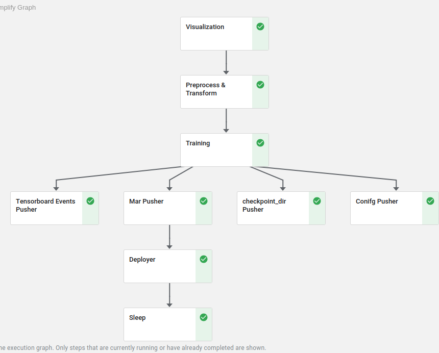
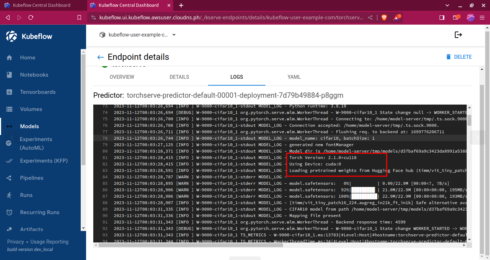
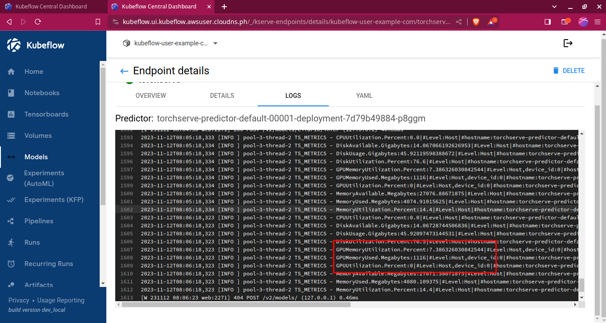

# CI/CD with Kubeflow Pipelines on EKS with GPU and External Domain

# Overview
In this session, we deploy an end-to-end CI/CD pipeline in Kubeflow provisioned inside EKS. This pipeline builds a docker image, pushes it to ECR, trains a model on GPU and deploys it on GPU as well. All of these steps are run as part of GitHub Actions, which required setting up a domain and a load balancer. Inference is run on a machine independent of the EKS cluster itself. 

# Setup

All of these steps are mentioned in the [setup guide](./setup.md).

# Running the CI/CD Pipeline
The GitHub Action has been configured to run manually, although we can modify it to run on push.

To ensure that the action workflow can commit to the repository during a run, enable 'Read and write permissions' in the repository settings. Also, set the action secrets with a the access key and secret access key of a user that has read/write permissions to Public ECR.

# Runs
Once the workflow completes, we can see a successful run

as well as all the steps.

# Serving

In the logs, we can see that GPU is indeed being used for serving

Also, during inference, we can see GPU utilization metrics.

The complete logs can be seen [here](./logs/kserve_log.md)
# Inference Demo

